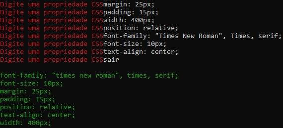
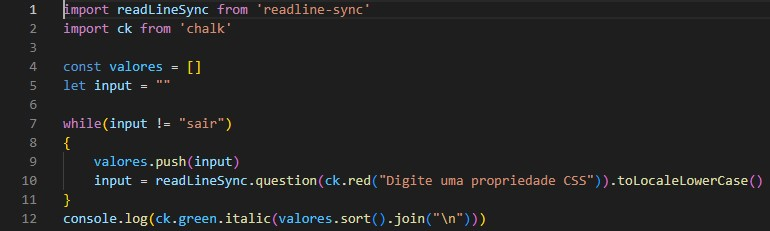

# Projeto-individual-Resilia-md5

PROJETO INDIVIDUAL Módulo 5 – Facilitando o dia a dia

Esse projeto teve como finalidade o uso do Node para montar um código que vai receber uma lista de propriedades de CSS (ex: background-color, font-size, text-align) e vai devolver essa lista ordenada de A-Z. Ordenar o CSS ajuda a encontrar mais rápido a propriedade que precisamos alterar.

## Prompt do Node 

Para realização do trabalho criei uma pasta no qual foi iniciado o npm para a instalação das bibliotecas "chalk" e "readlineSync". Logo após criei o arquivo index.js para colocar o código e integrar as bibliotecas npm instaladas.

## Código utilizado

## :hammer_and_wrench: Ferramentas utilizadas
* Visual Studio Code
* Node.js
* JavaScript

chalk :https://www.npmjs.com/package/chalk

readlineSync: https://www.npmjs.com/package/readline-sync
